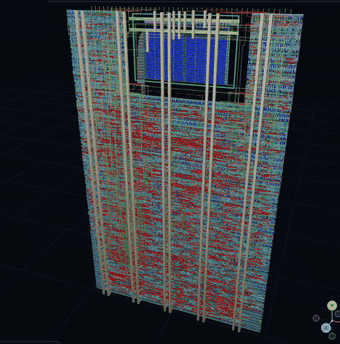
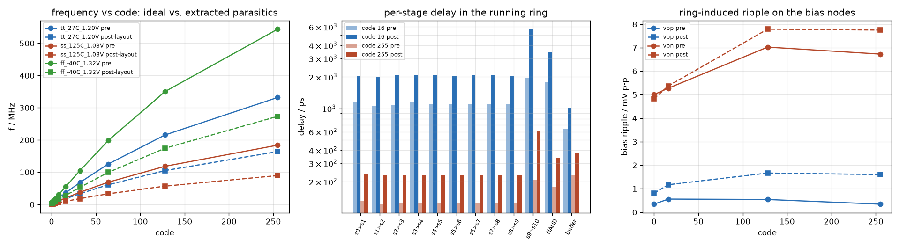
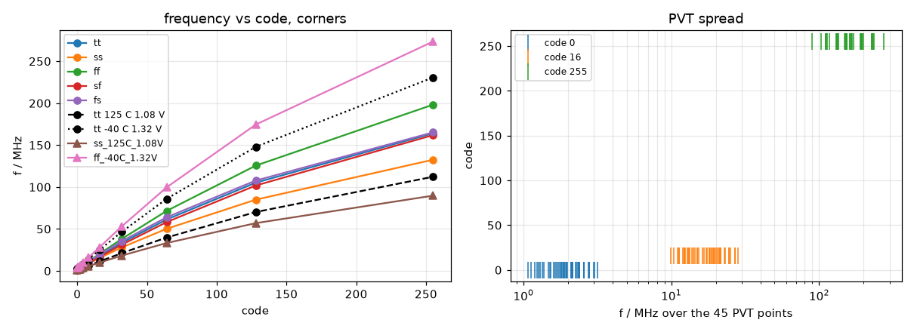

  

# Ring oscillator frequency meter, TTIHP 26b

Reciprocal frequency counter for eight on-chip ring oscillators, read over
the Tiny Tapeout pins. IHP SG13G2, 1x2 tile, digital pins only. Submitted:
tag `ttihp26b-submitted` (shuttle PR #237).

    f_ring = TARGET_N * 2^TAP_SEL * f_ref / RESULT        only f_ref (clk) must be accurate

| 3D, final GDS | layout |
|---|---|
|  |  |

Blue block: the analog ring macro. Still: [docs/tile_3d.png](docs/tile_3d.png). `make view` writes the glTF.

## What is on it

| block | what |
|---|---|
| rings 0..3 | 21-stage minimum-drive, identical netlists: within-die matching |
| ring 4 / 5 | 21-stage high-drive / 11-stage |
| ring 6 | tap-trimmed, 5..19 stages by `code[2:0]` |
| ring 7 | hand-drawn analog macro: current-starved, 8-bit current DAC, 91 x 57 um |
| instrument | mux, /1../128 divider, reciprocal counter, timeout, register file |
| stats page (`ui[7]`) | count / min / max / sum of `RESULT`, dice byte, `RING METER 26B` |

## Results

| digital | |
|---|---|
| testbenches (`make test`) | 9 / 9 pass |
| cocotb, RTL and gate level (CI) | 4 / 4 pass |
| sweep, 8 rings x 256 codes | 2048 / 2048 within +-1 count of the model (max 0.71 %, mean 0.13 %) |
| utilization | 67 %, 2426 cells, 265 flops |
| DRC / LVS / antenna / lint | 0 / 0 / 0 / 0; precheck 10 / 10 |
| worst setup slack, 1.08 V 125 C | `clk` +11.4 ns, divided ring (250 MHz) +0.15 ns, ring (1.25 GHz) +0.25 ns |
| setup / hold violations, 3 corners | 0 / 0 |

| analog ring, post-layout | |
|---|---|
| range, typical | 2.0 MHz (code 0) .. 164 MHz (code 255) |
| monotonic in code | 45 / 45 PVT points; 63 / 64 mismatch samples (one reverses the 127-128 step) |
| f(255) over PVT | 89.7 / 164 / 274 MHz (ss hot low / tt / ff cold high) |
| die to die | sigma 5.6-6.2 % |
| macro DRC / LVS | clean, schematic LVS-checked against the GDS |

| sweep: measured vs model | analog ring: code to frequency |
|---|---|
|  |  |

| analog ring over corners | macro layout |
|---|---|
|  |  |

## Pins

| pin | use |
|---|---|
| `ui[2:0]` / `ui[3]` | write address / write strobe |
| `ui[6:4]` | read select: 0 STATUS, 1..4 RESULT, 5 TRIM, 6 selects, 7 ID `0xA5` |
| `ui[7]` | 1: `uo` shows the stats byte indexed by `uio[4:0]` |
| `uio[7:0]` / `uo[7:0]` | write data / read data |

Write: 0 TRIM_CODE, 1 RING_SEL, 2 TAP_SEL, 3/4 TARGET_N, 5/6 TIMEOUT, 7 START.

## Documents

| | |
|---|---|
| [docs/info.md](docs/info.md) | project page, how to test |
| [docs/registers.md](docs/registers.md), [docs/pinmap.md](docs/pinmap.md) | registers, stats page, protocol |
| [docs/rings.md](docs/rings.md), [docs/constraints.md](docs/constraints.md) | ring population, timing constraints |
| [docs/design_notes.md](docs/design_notes.md) | decisions |
| [analog/README.md](analog/README.md), [layout](docs/analog_layout_notes.md), [verification](docs/analog_verification.md) | the analog block |
| [docs/stretch/](docs/stretch/README.md) | next: Banba bandgap + sigma-delta readout (idea only) |
| [CLAUDE.md](CLAUDE.md) | working notes |

## Make

| target | does |
|---|---|
| `make test` / `make sweep` | every testbench / 8 x 256 sweep and plots |
| `make cocotb` | the CI testbench |
| `make tools harden precheck` | LibreLane and the TT precheck, as CI |
| `make view` | 3D glTF of the hardened tile |
| `make macro`, `make -C analog verify` | analog block: build, DRC, LVS; corners, Monte Carlo, noise (~1 h) |

Branches: `main` = `ring-osc-meter` (this); `analog-inverter` = the earlier mixed-signal hello world.

Built with [Tiny Tapeout](https://tinytapeout.com).
