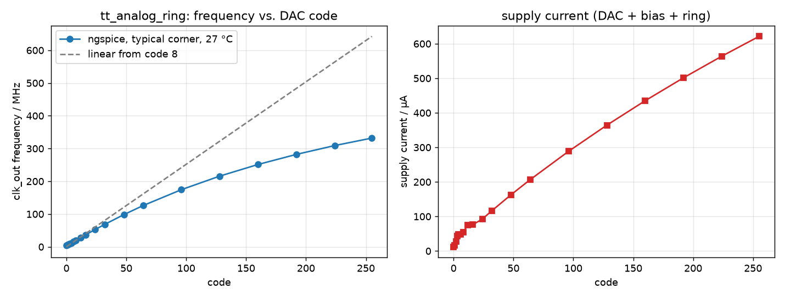

# The analog block: a current-starved ring oscillator with an 8-bit current DAC

The hand-generated hard macro that fills ring slot 7 of the frequency meter.
This directory owns the block and nothing else. The tile is hardened by
LibreLane from the repository root, and the only things it needs from here
are three committed files:

| committed | is | built by |
|---|---|---|
| `macro/tt_analog_ring.gds` | the layout | `make gds` |
| `macro/tt_analog_ring.lef` | its abstract, for placement and routing | the same script, from the same constants |
| `lib/tt_analog_ring.lib` | its Liberty model, for synthesis and STA | `make lib` |

plus `macro/tt_analog_ring.v`, the blackbox the RTL instantiates, and
`spice/tt_analog_ring.spice`, the transistor-level netlist, which is also
generated and committed because it *is* the schematic (see below).

Everything runs inside the `hpretl/iic-osic-tools` container via `./run.sh`,
so Docker is the only host dependency.

```bash
cd analog
make help       # every target, one line each
make macro      # gds + lib + drc + lvs: what the tile needs
make sim plot   # frequency vs. code sweep -> ../docs/analog_ring_sweep.png
make png        # layout figures -> ../docs/
```

Both PDK runners exit non-zero on failure, so `make` genuinely stops.

## The circuit

Everything analog lives inside; every port is a rail-to-rail digital signal.

```
 code[7:0] ──▶ 255 unit NMOS, binary weighted ──┐
              (+2 always-on units, gate on VPWR) │ I_dac
                                                 ▼
                          diode PMOS MPD (24 × 2/0.5) ── vbp ──▶ PMOS starve of every stage
                          PMOS mirror MPM (1/0.5)  ─▶ diode NMOS MND (0.5/0.5) ── vbn ──▶ NMOS starve of every stage

 enable ──▶ starved NAND ─▶ 10 starved inverters ─┐
              ▲                                    │
              └──────────── feedback (s10) ────────┘
                                                   └─▶ inverter ─▶ inverter ─▶ clk_out
```

**The DAC.** Each code bit is the gate of 2^k identical NMOS fingers,
W = 0.15 µm, L = 8 µm, source on VGND, drain on the common node `vbp`. Bit 7
is 128 fingers, bit 0 is one. The gate swings rail to rail from the digital
signal, so there is no bias voltage, no reference and no start-up question:
a finger is either fully on or off, and the total current is proportional to
the number that are on. The long channel is what keeps a fully-on finger
down to about 2 µA; at minimum length the same finger would sink 100 µA and
the array would burn 25 mW. Two extra fingers with their gate on VPWR keep
the ring alive at code 0, so a dead ring is distinguishable from code 0.

**The bias.** `vbp` is the diode-connected PMOS MPD, 24 fingers of
2 µm / 0.5 µm. Each ring stage's PMOS starve device is a single
1 µm / 0.5 µm finger, so a stage gets I_dac / 48. The diode is that wide
on purpose: the wider it is, the less its gate voltage moves with current,
and the less the DAC's drain node sags (see the compression below). MPM, another single finger, mirrors that current
into the diode-connected NMOS MND, whose gate voltage `vbn` drives the
stages' NMOS starve devices. One DAC, one place to debug, eleven copies of
the same current.

**The ring.** A starved NAND (inputs `enable` and the feedback) followed by
ten starved inverters: eleven inverting stages. Each stage is four
transistors, the inverter (PMOS 0.5, NMOS 0.3, both L = 0.13) between a
PMOS starve on `vbp` and an NMOS starve on `vbn`. With `enable` low the
NAND output is held high and the loop stops in a defined state, the same
convention as the standard-cell rings. Two unstarved inverters buffer the
last stage out to `clk_out`, so the tile's mux never loads the loop node.

The netlist is written by the layout generator itself, one line per
transistor finger as placed, and that netlist is what LVS compares the
layout against and what ngspice simulates. There is no separate schematic
to drift from the layout.

## Simulated behaviour

Typical corner, 1.2 V, 27 °C, `clk_out` into 15 fF (`make sim`):

| code | f / MHz | supply current / µA |
|---|---|---|
| 0 | 3.8 | 12 |
| 1 | 5.8 | 17 |
| 8 | 20.2 | 54 |
| 32 | 68.5 | 117 |
| 64 | 126 | 207 |
| 128 | 216 | 364 |
| 255 | 332 | 621 |



The curve is linear at the bottom (2.0 MHz per code) and compresses
gently after that: at full scale the frequency is 63 % of the straight
line. Two things do this, both physical and both worth measuring:

- **The DAC units are in triode.** Their drain sits on the diode node, which
  falls from 0.84 V at code 1 to 0.46 V at code 255 as the diode carries more
  current, and a triode transistor's current follows its drain voltage. That
  is the "channel-length modulation, the whole business" the brief asked to
  characterise, only more so. With 1 µm diode fingers instead of 2 µm the
  node fell to 0.36 V and full scale was 45 % of the line; a cascode or a
  regulated drain would remove it at the price of a real analog bias loop.
- **The ring has a delay floor.** Above ~15 µA per stage the starve devices
  are no longer the bottleneck and the inverters' own delay takes over.

The code-to-frequency map is monotonic throughout, which is what the
instrument needs. The compression is a known, simulated shape that the
measured curve can be compared against.

Supply current is essentially the DAC current: 2.4 µA per unit at full
scale, plus a few tens of µA for the mirror and the running ring. It is
drawn whenever the code is non-zero, whether or not `enable` is high, so
park the code at zero between measurements.

## Interface

| pin | layer / edge | |
|---|---|---|
| `code[7:0]` | Metal2, south edge | DAC code, DC control. Bit 7 widest. |
| `enable` | Metal2, south edge | 1 = oscillate; 0 holds the loop, `clk_out` rests high |
| `clk_out` | Metal3, east edge | the free-running output |
| `VPWR`, `VGND` | Metal4 bars across the full width | for the tile's PDN to via down to |

**Input capacitance doubles per bit**, measured: 9.6 fF on `code[0]`,
1.30 pF on `code[7]`, 2.2 fF on `enable`. The Liberty carries these numbers,
so LibreLane sizes and buffers the drivers itself; a slow edge on a code bit
is harmless, it is a DC control.

**`clk_out` has no timing arc.** It is a free-running oscillator, not a path
from any input, and the Liberty says so by leaving it out. The tile must
declare it as a clock source (`create_clock` on the macro instance's
`clk_out`, with a period for the fastest expected code), exactly as the
standard-cell rings need their loops declared.

## Layout

90.72 × 56.7 µm: 189 CoreSite widths by 15 rows, so it lands row-aligned
in the tile. `docs/macro_layout.png` is the whole block, `docs/ring_row_layout.png`
and `docs/dac_rows_layout.png` are close-ups.

**The DAC** is 34 rows of unit fingers (16 rows of 8 for bit 7, 8 for bit 6,
4 for bit 5, 2 for bit 4, then one row each of 8, 4, 2 and 1 fingers for
bits 3..0). Rows come in mirrored pairs: the pair shares a Metal1 `vbp` bar
between its rows and a Metal1 VGND bar with the neighbouring pair. A row's
gates are joined by a poly bar contacted at the row's left end and jogged
in Metal1 to a vertical Metal2 code bus, which runs straight down to the
pins on the south edge. Each row is split in two around a column of p+
substrate-tie islands, one under every VGND bar, with two more columns of
islands at the rows' ends: the latch-up rule wants a tie within 20 µm of
every finger, and the rows are 69 µm long.

**The ring row** is laid out like an oversized standard cell: NMOS devices
along the bottom, PMOS along the top, a VGND rail under and a VPWR rail
over, all the devices' gates vertical. In the gap between the two device
rows five horizontal slots carry, bottom to top: the Metal1 stage-to-stage
jogs, the `vbn` line, the `vbp` line, the feedback line and the enable line,
the last four on Metal2. Each stage is `[NMOS starve | NMOS] / [PMOS starve
| PMOS]` with its output strap on the right, so the jog to the next stage's
input pad never crosses anything but poly. The row holds, left to right:
the always-on units, the 24-finger diode MPD (with MND and MPM), the NAND,
the ten stages and the output buffer, whose Metal3 output runs east to the
pin.

**Supplies.** Two horizontal Metal4 bars spanning the full width, sitting
over the two Metal1 rails with 3 × 3 via stacks between, so any TopMetal1
grid strap of the tile's PDN that crosses the block meets both. The tile's
`PDN_HORIZONTAL_LAYER` must be `Metal4` for pdngen to drop those vias, as
on `main`. NWell ties sit under the VPWR rail and substrate ties under the
VGND rail, all covered by the rails' own Metal1.

**Boxed in.** A grounded p+ guard ring surrounds everything and the LEF
declares Metal1..Metal4 obstructed over the whole footprint except the pin
windows and the two power bars.

## Signoff

`make drc` runs the PDK's maximal KLayout rule set with density disabled
(`--no_density`): **0 violations**. `make lvs` runs the PDK's KLayout LVS
against the generated netlist with tap extraction disabled: **netlists
match**, 333 transistor fingers.

Density is deliberately not checked at block level (`make drc-density`
reports it, expectedly failing): metal density is a property of the whole
tile, which is where the flow's own signoff DRC checks it. The inverter
macro on `main` passed that check placed inside a tile, and this block has
far more metal.

## What the generator does not do yet

- **Corners.** Only `mos_tt` at 27 °C is simulated and characterised. The
  ring's frequency is expected to move a lot over process, supply and
  temperature; that is the point of the instrument, and `make sim
  CORNER=mos_ss TEMP=85` etc. is how to get the expected numbers.
- **Parasitic extraction.** The row is dense enough that wire capacitance
  will shift the frequency by some percent; kpex is in the container and
  the previous block's notes on `main` describe the shape of a `make pex`.
- **Linearity.** See above. If the compression turns out to matter more than
  the simplicity, the fix is a cascode on the DAC's drain node.
